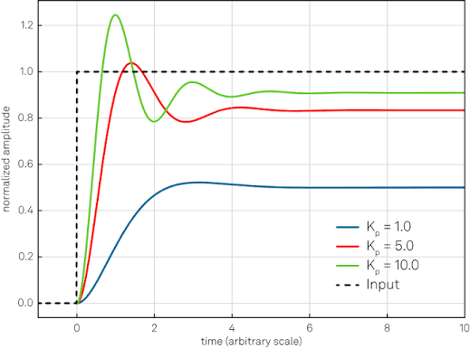
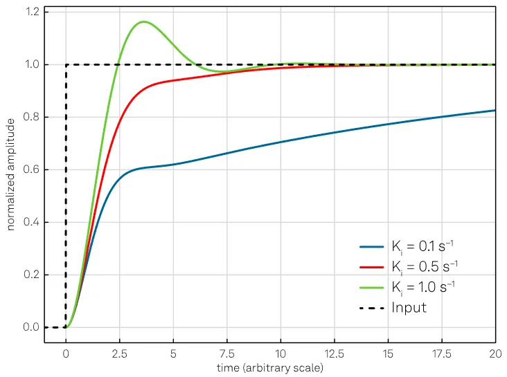
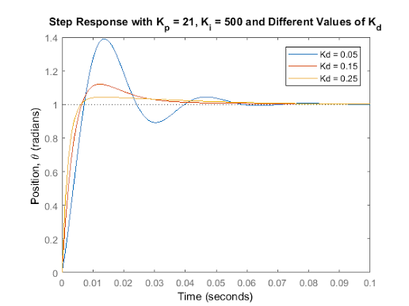

# PID Controller

PID制御の基本について解説する.

本稿では高度な実装やラプラス変換を用いた制御工学的な理論には敢えて踏み込まず、直感的なPIDそのものの理解と簡単な実装を眺めることを目標としている.

## What is PID Control

目標値と現在値の差（偏差）をもとに制御入力を決定するフィードバック制御手法.

比較的簡単な調整で安定した制御を実現できるため、産業機械、自動車、ロボットなど幅広い分野で利用されている.

以下の3つの要素で構成される.

- P(Proportional) : 比例 
- I(Integral)     : 積分
- D(Derivative)   : 微分

センサやエンコーダから取得した現在値と目標値の差分である偏差(error)、またその積分/微分値にそれぞれある定数(gain)を掛け足し合わせることで実現する.

## Theory


[PID制御ブロック線図]

### 連続時間での式

偏差:

$$
e(t) = r(t) - y(t)
$$

- e(t): Error(偏差)
- r(t): Reference(目標値、setpoint)
- y(t): Output(現在値)


制御入力:

$$
u(t) = K_p e(t) + K_i \int_0^t e(\tau)\,d\tau + K_d \frac{de(t)}{dt}
$$

- e(t): Error(偏差)
- Kp: Proportional Gain(比例ゲイン)
- Ki: Integral Gain(積分ゲイン)
- Kd: Derivative Gain(微分ゲイン)

### P Term

現在の誤差に比例した入力を与える. 

現在の値を見て制御量を調整する制御であり、車の運転で言うと、アクセルの踏み加減にあたる. 目標まで遠いほどアクセルを強く踏み、近いほど弱く踏む.

Equation:

$$
u(t) = K_p e(t)
$$




図ではKpを増加させると誤差をより強く修正する様になることがわかる.

しかし、ゲインを上げると即応性が改善するが、値が大きくなると振動したりオーバーシュート(setpointを通り過ぎる)する場合がある.

また、外乱や負荷があると目標値に一致せず定常偏差(Steady-state error)が発生することがある.

P制御は応答速度と安定性のトレードオフである.

### I Term

過去の誤差を蓄積して補正する.

車の運転では、坂道で落ちた速度をアクセルを踏み直して持ち直すのに似ている.

Equation:

$$
u(t) = K_I \int_0^t e(\tau)\,d\tau
$$



図ではゲインを上げると定常偏差が減少していることがわかる. このため、主にI制御は定常偏差を小さくするために用いられる.

I制御では誤差がある状態が長時間続くと、積分値がどんどん大きくなり、オーバーシュートや振動、応答の遅れを招くことがある. これを積分ワインドアップ(Integral Windup)と呼び、積分値に上限と下限を設けることが一般的な対策となる.

Kiは定常偏差をなくす速さと安定性のトレードオフである.

### D Term

変化量を見る.

車の運転では、速度を見てブレーキをかけることに相当する. 偏差の変化率から将来の挙動を先読みするように働くため、「未来を予測する制御」と表現されることがある.

Equation:

$$
u(t) = K_d \frac{de(t)}{dt}
$$



図ではKdを増加させるとオーバーシュートを低減させていることがわかる. 

Kdを上げすぎると、ノイズを増幅しやすく、制御入力が不安定になったり、応答が鈍くなったりしてしまう. これは微分が変化量を見るため、センサの微細なノイズまで急激な変化として反応してしまうことによる.

### P, I, Dの組合せ

PID制御ではP, I, Dを必ず全部使う訳ではない. P制御だけ用いたり、PI制御を実装したりする.

以下よくあるパターン:

- P制御
    - シンプルかつ高速だが、定常偏差が残る
    - 簡単な速度制御など
- PI制御
    - 定常偏差をなくせる
    - モータ速度制御、温度制御 etc.
- PD制御
    - オーバーシュートや振動を抑える
    - ロボットの位置制御、姿勢制御 etc.
- PID制御
    - 応答速度、精度、安定性のバランスが良い
    - 幅広く産業で用いられる

PID制御はかなり柔軟で、例えばサーボモータでは

- 外側: 位置PD
- 内側: 速度PI

というカスケード制御がよく採用されている.

### 結局PIDの強みとは

PID制御をするにあたって、制御対象の数理モデルは必要ない. モデル不要のFB(Feedback)制御という扱いやすさや実装の容易さもあって広く用いられている.

また、計算量が他の制御と比べて少ないのも強みである. ゲイン調整もある程度直感的である.

結局のところ、

1. センサで現在値yを測る
2. 目標値rと比較して誤差eを求める
3. 制御入力uを求める

という流れだけで動作するというシンプルさもあってある程度雑でも動いてしまう. PID制御は比較的ロバストであり、幅広い制御対象に適用しやすい。

### PID式の離散化

先程まで扱っていた式は離散時間での式であり、これを離散化しないと計算機で扱うことはできない.

$$
u(t) = K_p e(t) + K_i \int_0^t e(\tau)\,d\tau + K_d \frac{de(t)}{dt}
$$

まずこの式をサンプリング周期Tsで離散化することを考える.

まず誤差を離散化する.

$$
e(t) -> e[k]
$$

I項には積分があるが、勿論離散時間ではそのまま扱えないので、積分は長方形の面積の和で近似できることを用いて

$$
\int_{0}^{t} e(\tau)\,d\tau
\approx
\sum_{i=0}^{k} e[i]\,T_s
$$

これは矩形積分と呼ぶ. 他に台形積分などの手法もある.

微分は変化率なので、差分として近似して

$$
\frac{de(t)}{dt}
\approx
\frac{e[k]-e[k-1]}{T_s}
$$

この近似を後退差分（Backward Difference）による近似と呼び、PID制御で最もよく使われる離散化方法の一つである.

此等を代入すると、離散化されたPIDの式は以下の様になる.

$$
u[k]
=
K_p e[k]
+
K_i T_s \sum_{i=0}^{k} e[i]
+
K_d \frac{e[k]-e[k-1]}{T_s}
$$

しかし、これでは積分を毎回計算するのは効率が悪いので、以下の様に前回の積分値に今回の面積を足す形に書き換える.

$$
I[k] = I[k-1] + e[k]T_s
$$

まだD項を

$$
D[k] = \frac{e[k]-e[k-1]}{T_s}
$$

として、

離散PID制御則:

$$
u[k] = K_p e[k] + K_i I[k] + K_d D[k]
$$

### 基本実装例

離散化したPID制御則を用いて、以下C++での簡易的なPID実装例を示す.

```cpp
class PID {
public:
    PID(double kp, double ki, double kd, double ts)
        : Kp(kp), Ki(ki), Kd(kd), Ts(ts) {}

    double update(double reference, double output) {
        // 偏差
        double error = reference - output;

        // 積分項
        integral += error * Ts;

        // 微分項
        double derivative = (error - previous_error) / Ts;

        // PID制御則
        double control =
            Kp * error +
            Ki * integral +
            Kd * derivative;

        // 次回のために保存
        previous_error = error;

        return control;
    }

private:
    double Kp;
    double Ki;
    double Kd;
    double Ts;

    double integral = 0.0;
    double previous_error = 0.0;
};
```

### 応用

実際には、この基本実装に加えて

- 出力飽和: (PWM値などに制限をかける)
- Anti-Windup: 積分値が増えすぎないように制限
- 微分項にLPF(Low-pass Filter): センサノイズ対策

は少なくとも実装したい.

#### 出力飽和 (Output Saturation)

例えばモータ制御の場合、最大出力があるので, 

```cpp
control = std::clamp(control, -100.0, 100.0);
```

#### Anti-windup

出力飽和しているのに積分し続けると積分項が巨大になってしまうので、

```cpp
integral = std::clamp(integral, -Imax, Imax);
```

または

```cpp
if (!output_saturated) {
    integral += error * Ts;
}
```

#### 微分Filter

微分はノイズを増幅するので、以下のような軽量なLPFを通すことがよくある.

```cpp
filtered =
    alpha * filtered +
    (1.0 - alpha) * derivative;
```

#### サンプリング周期について

PID制御はTsが一定であることを前提としているので、一定周期で実行することが重要である.

マイコンならタイマ割り込み、ROS2ならTimerを使うと良い.

Linuxでは周期がずれることがあるので、以下の様にdtを実測し、実際の時間差を用いる場合もある.

```cpp
Ts = current_time - previous_time;
```

#### Deadband

誤差が十分に小さいなら制御する必要はない.

```cpp
if (std::abs(error) < 0.01)
    error = 0;
```
#### Derivative Kick対策

通常

```cpp
D = (error - prev_error) / Ts;
```

であるが、D項を誤差ではなく出力で計算し、

```cpp
D = -(output - prev_output) / Ts;
```

とすると、目標値が急に変わった時に暴れにくくなる.

#### Init時

起動直後は以下のように初期化しておく.

```cpp
previous_error = error;
integral = 0;
```

## Gain Tuning

PID制御では、適切なゲインを設定することが重要である.

典型的な手法では、

1. まずI, Dを0にする

    Ki = 0  
    Kd = 0

2. Kpを徐々に上げる

    応答が遅いならKpを上げ、
    振動やオーバーシュートが大きいなら下げる

    これを繰り返し、安定して素早く応答する値を探す

3. Kiを追加する

    P制御では定常偏差が生じることがあるので、その場合はKiを少しずつ増加させ、定常偏差がなくなるかつ振動が起こらない範囲で調整する.

4. Kdを追加する

    オーバーシュートや振動が大きい場合はD項を追加する. Kdを増加させると減衰が強くなる.

    Kdを大きくするとノイズを増幅するので注意.


Ziegler-Nichols法(所謂、限界感度法)という手法もよく知られているが、これは比較的攻めたゲインを与えるため実機制御ではさらに調整することが多い.

とにかく、一気にそれぞれのゲインを調整しようとするのは得策ではなく、まず一つずつ決めて、後で微調整するのが良いと思われる.

## PID制御の限界

PID制御は制御対象の数理モデルを必要としないが、逆に言うと制御対象の特性を積極的に制御に利用することができない.

そのため、高速性や高精度が求められるシステムではモデルベース制御の方が優れた性能を発揮する場合も多い.

また、PID制御は現在と過去の誤差のみを使用するため、入力から出力までの遅れが大きいシステムでは性能が低下しやすい. 強い非線形性をもつシステムでも十分な性能が得られないことがある.

更に、モータ電流やトルクなどの制約を考慮することができないことも挙げられる. こうした制約を考慮した最適制御が必要な場合はMPCなどが利用される.

実際の制御ではPIDだけではなく、FF(Feed Forward)やLQR, MPC, Adaptive Controlなどを組み合わせて実装されていることも多い.

PID制御が古くても使われる理由は、完璧だからではなく、シンプルで実装しやすく、多くのシステムで十分な性能を発揮することができ、実機での調整も比較的楽である、という工学的かつ現実的な強さがあるからだと考える.
