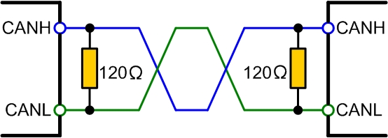
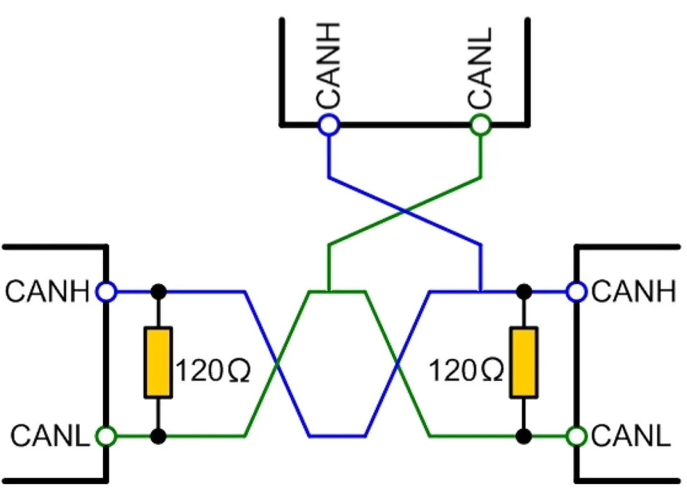

# CAN (Controller Area Network)

## What is CAN

複数のマイコンやデバイスが1本の通信バスを共有するための通信規格. 
自動車やロボットなどでよく使われる.

ノイズに強く、リアルタイムで複数ノードが通信することができる.

高速なデータ転送ではなく、分散した制御システムを安全に動かすことが目的なので、Ethernetよりは遅いしデータ量も少ない.


## 物理層でのCANの分類

- High-speed CAN（ISO 11898-2）

    最も一般的なCAN.

    ここで解説するのもこれ

    - 最大1Mbps (Classic CANの場合)
    - 差動通信
    - 120ohm終端

    CAN FDでも使われる.

- Low-speed / Fault-tolerant CAN（ISO 11898-3）
    
    - 低速
    - 配線障害に強い


## 基本構成



2本の信号線を使い、CANトランシーバのCAN_H, CAN_Lを使ってノード同士が接続される.

各ノードは基本的に:

- MCU (要するにマイコン)
- CAN Controller
- CAN Transceiver

を持つ.

CAN ControllerはMCUに内蔵されていることもある.

- STM32
- Renesas RAシリーズ

MCP2515 moduleなどを使えば、SPIからCANに容易に変換することが可能である.




ノードを追加する時は、バスにぶら下がるように追加していく.

ここで、追加したノードには抵抗(120ohm)をつけないことに注意. 抵抗は終端だけに入れる.

CAN_H, CAN_L間の抵抗値をテスターなどで測って、60ohmになっていれば正常. (120ohmの抵抗が並列に2つ存在するから)

## Twist Pair Cable

ツイストペア線とは、2本の導線を互いにねじったケーブルである. 2本を一定間隔でねじることで、電磁ノイズへの耐性を高めることができる.

ノイズの入り方を均一化することを目的としており、例えば外部から磁界ノイズが入る場合、ねじっていないとCAN_HまたはCAN_Lの片方が強く影響を受けてしまい、後述するVdiff(差分)を計算した時に綺麗にnoiseが消えない.

また、電磁放射低減も見込める. 普通の2本線では2つの線が一定距離離れておりループ面積が大きい. 

線に電流が流れると

B∝I

より磁界が発生し外部に漏れてしまう.

ここでツイストペアにしておくことで、2つの線が近くに存在し、電流の方向がそれぞれ逆に流れるため磁界の向きも逆で打ち消し合う.

受信性能とEMI対策になる.

CANだけでなく一般的なLANケーブルやUSBでも使われる.

## Termination Resistor (終端抵抗)

高速な通信線で起こる信号反射を防ぐために入れる抵抗. 
一般的にバスの両端に120ohmを入れる.

ケーブルには固有のインピーダンスZが存在し、CANのケーブルだと約120ohmとなっている. ここで終端抵抗が無い場合、信号を送ると端まで来た信号は行き場がなくなり、解放端でインピーダンス無限であることから反射係数が1となるため100%反射してしまう.

終端120ohmを入れると反射係数は理論上0となり反射なしとなる. CAN busは両端終端なので両方の端にのみ120ohm抵抗を入れる. ここで電源OFF状態でCAN_H, CAN_L間抵抗が約60ohmであることを必ず確認する.

終端をいれないと通信エラーやCRC error, ACK errorなど様々な問題が出やすい.

また、抵抗の入れすぎもCANトランシーバが大電流を流す必要があり問題が出てくるのでやってはいけない.

## CAN Controllerの仕事

MCU側から見ると、

Application -> CAN Driver -> Can Controller -> CAN Transceiver -> CAN Busとなる.

CAN Controllerが自動で：

- Frame生成
- CRC計算
- ACK処理
- Error処理
- Arbitration

などを行う.

## 差動通信

CANは電圧そのものではなく、

Vdiff = CAN_H - CAN_L

の電圧差を見る.

外部ノイズが入っても、

- CAN_H + noise
- CAN_L + noise

なら差分ではnoise分が消える為ノイズに強いと言える. これをコモンモードノイズ除去と呼ぶ.

## bitrate

1秒間に送信できるbit数.

bps = bits per second

CANではBitrateはバス上の全ノードで一致している必要がある.

bitrateが違うと、同じ波形を見てもbitの区切り位置が違うため、通信できない. またbitrateをあげると長距離通信が難しくなるが、1Mpbsでも40m程度なら問題なく通信できる.

### CAN bus上の論理状態

#### Recessive (1) - 劣勢

何も強く駆動していない状態.

論理1であり、電圧差は0v.

- CAN_H = 2.5v  
- CAN_L = 2.5v

=> diff: 0v

#### Dominant (0) - 支配的

CAN Tranceiverが線を駆動している状態.

論理0, こちらが支配的になる.

以下の値はapprox.(約)であることに注意.

- CAN_H = 3.5v
- CAN_L = 1.5v

=> diff: 2v

### 何故0がDominantなのか

CANは複数ノードが同じ線を共有するが、

- Node A: recessive (1)
- Node B: dominant (0)

となるとCANトランシーバが線を駆動するNode Bの方が優勢となり、Busはdominantになる.

つまり、0が1を上書きすることとなるので"Dominant"である.

### Arbitration (仲裁)

複数のノードが同時に送信しようとした時、どのノードが送信権を得るか決める仕組み.

電気的にはwired-AND的性質で勝手に決まる. 論理的にはdominant/recessiveによる非破壊アービトレーション.

要するに =>  0 AND 1 = 0

2つのノードが同時送信する場面を考える

- A: 1010
- B: 1001

このとき両方のMSB(Most Significant Bit)から2bit目までは同じで、3bit目はAが論理1, Bが0である.

MSBから3bit目で、

- A -> 1(recessive)
- B -> 0(dominant)

なのでBが勝ち、Aは1を送ったにも関わらずbusはdominantになったことを検出し送信をやめる.

## CAN Frame

CANバス上で送信される1つのメッセージの形式.

CANではデータをそのまま流すのではなく、決まった構造(Frame)に入れてから送信する.

### CANの種類

- CAN 2.0 (Classic CAN)

    最も基本的なCAN.

    - CAN 2.0A (Standard Frame)
        
        ID: 11 bit
        Data: max 8bytes

    - CAN 2.0B (Extended Frame)

        ID: 29 bit
        Data: max 8bytes

- CAN FD

    Classic CANの拡張

    Dataが64bytesまで扱える.

- CAN XL

    さらに新しい拡張

    最大2048 byte級のデータが扱える

### CAN 2.0A (Standard Frame, 11bit ID)

- SOF       1 bit (dominant)
- ID        11 bit
- RTR       1 bit
- IDE       1 bit (dominant)
- r0        1 bit (dominant)
- DLC       4 bit
- DATA      0-8 byte
- CRC       15 bit + delimiter 1 bit
- ACK       2 bit
- EOF       7 bit (recessive)

r0はreserved(予約)bit. 拡張余地のために存在するが、dominant固定.

※CAN 2.0BではここにExtended ID用のフィールドが追加される. 11bit Identifierを保持したまま18bitを追加し、29bit Identifierを構成する

### CAN 2.0B (Extended Frame, 29bit ID)

- SOF       1 bit (dominant)
- Base ID   11 bit
- SRR       1 bit (recessive)
- IDE       1 bit (recessive)
- Ext ID    18 bit
- RTR       1 bit
- r1        1 bit (dominant)
- r0        1 bit (dominant)
- DLC       4 bit
- DATA      0-8 byte
- CRC       15 bit + delimiter 1 bit
- ACK       2 bit
- EOF       7 bit (recessive)

r1, r0はdominant固定.

### Standard Protocol解説

#### 1. SOF (Start of Frame)

フレーム開始を示す. 全ノードの同期にも使われる.

CAN busは通常recessiveで待機しているが、
送信ノードがSOFとして0を送ることでIdle状態から送信開始となる.

1bitで、常にdominant.

- SOF = 0


#### 2. Arbitration Field

この部分を送信している間にアービトレーションが発生する.

構成要素:

- Identifier (ID)
- RTR

ここで送信優先順位を争うことになる. 勿論CAN Identifierの数値が小さいほど優先度が高い(Arbitrationが働くため)

Extendedなら

- Base ID
- SRR
- IDE
- Extended ID
- RTR

##### CAN ID

一例だが、以下のようにapplication側で決める.

CAN自体は意味を知らない. ただの番号.

- 0x100 → Motor command
- 0x200 → Encoder data
- 0x300 → IMU data

##### RTR (Remote Transmission Request)

昔使われたRemote Frame用

- 0: Data Frame
- 1: Remote Frame

現代のロボット用用途ではほぼData Frame一択.

RTR = 1はそのIDのデータを送ってくださいという意味. 通信タイミングを制御しづらかったりするのであまり使われない.


#### 3. Control Field

- IDE (Identifier Extension)
- DLC (Data Length Code)


##### IDE

ID形式を指定する. Standardならdominant.

Extendedを使う時はrecessiveにして、Identifier Extensionを有効化する.

- IDE = 0: Standard Frame (11bit)
- IDE = 1: Extended Frame (29bit)

##### DLC

Data Fieldの長さを示す.

DLC = 8ならDataが8バイトであるという意味.

#### 4. Data Field

実際のアプリケーションデータ.

Classic CANなら0-8 bytes.

Ex.

======  
ID: 0x200

DATA:[0x12 0x34 0x56 0x78]

======

例えば、一例だがモータ制御なら以下のようにアプリケーション側で決める.

- byte0-1 : target position
- byte2-3 : velocity
- byte4-5 : torque

#### 5. CRC Field

エラー検出用.

送信側でデータからCRCを計算し、付与する. 受信側では受信したデータからCRCを再計算し、一致するか確認する. 違えばエラー.

#### 6. ACK Field

受信側がちゃんと受け取ったことを知らせるためのフィールド.

CANでは送信ノードではなく受信ノードがACKを出す.

- ACK Slot
- ACK Delimiter

の2bit.

送信側がACK Slot = recessiveで送り、
正常に受信したノードがACK Slot = dominantに変更する. ここで誰かが受け取ったことを確認できる.


#### 7. EOF (End Of Frame)

フレーム終了通知　.

7 recessive bits: 1111111

### Extended(2.0B)の場合

#### SRR (Substitute Remote Request)

Standard Frame（11bit ID）とExtended Frame（29bit ID）が同じID先頭部分で競合した時に、Standard Frameを優先させるためのビット. recessive固定.

位置はStandardのときのRTRの位置.

BaseIDが被った時、StandardでRTRが0ならBaseIDの次のbitであるRTR/SRRでarbitrationが起こり、RTRがdominantなのでExtendedは負ける.

これはCAN 2.0Aが存在するネットワークでの後方互換性を保つための設計である.

#### Ext ID

[11bit Base ID][18bit Extended ID]

この後ろの部分.

CANが実際にやっているのはMSBから1bitずつ比較（非破壊アービトレーション）であるが、29bit整数として比較しても優先順位は変わらない.

BaseIDとExtended IDを結合する際はビットシフトが必要.

### Bit Stuffing

CAN通信で同期を維持するために、送信データ中に意図的に余分な1bitを挿入する仕組み.

CANのルールでは、同じ論理レベルが5bit以上連続したら、反対のbitを1つ追加する.

送信したいデータが

11111110

のとき、実際は

11111 0(stuff bit) 1110

となる. 

受信側のCAN Controllerがstuff bitを除く.

5個同じbitが来た後に反転bitが来ない場合、Stuff Errorとなる.

このとき、CAN Controllerは,

- Error Frame送信
- 再送
- Error Counter増加

を行う.

### Bus-off

CANノードがエラーを起こしすぎたため、自分自身を通信から切り離す状態.

壊れたノードがCAN busを荒らすのを防ぐための仕組み.

CAN Controllerはエラー数をカウントしており、主に

- TEC (Transmit Error Counter)
    - 送信エラーカウンタ
- REC (Receive Error Counter)
    - 受信エラーカウンタ

を持っている.

1. Erorr Active

通常状態. エラーが起こるとカウントが増加する.

条件:
- TEC < 128
- REC < 128

2. Error Passive

通信は継続可能だが、影響力が低下する. Busを強くdominantしない.

条件:
- TEC >= 128
or
- REC >= 128

3. Bus Off

通信停止.

条件:
- TEC >= 256

この状態では

- 送信しない
- Error Frameも出さない
- Busから隔離される

流れとしては、

エラー多い  
↓  
Error Passive  
↓  
さらに悪い  
↓  
Bus Off  

として隔離する.

CAN Controllerによって異なるが、一定の方法で復帰も可能.

## SocketCAN

LinuxでCANを扱うための標準CANインターフェース.

Device Driver内で`register_candev()`で登録されていれば基本的にSocketCANから使える.

application側からは

```c
socket(AF_CAN, SOCK_RAW, CAN_RAW)
```

のように普通のsocketAPIで叩ける.

一言で言えば、CANを普通のLinuxネットワークソケットとして扱えるようにした仕組み.

なので、コマンドを用いて

```bash
$ ip link
can0 ..
can1 ..
```

のように出る.

基本的なオペレーション:

```bash
# can0を1mpbsで有効化
$ sudo ip link set can0 up type can bitrate 1000000

# 停止
$ sudo ip link set can0 down

# FD
$ sudo ip link set can0 up type can bitrate 1000000 dbitrate 2000000 fd on

# 確認
$ ip -details link show can0
```

送受信:

`can-utils`を用いる

```bash
# debian-based can-utils入ってないなら
$ sudo apt install can-utils

# 送信
$ cansend can0 123#1122334455667788

# 受信
$ candump can0

# Filter
$ candump can0,200:7FF

# Traffic
$ cansniffer can0
```

#### module

```bash
$ lsmod | grep can

can_raw # for candump etc.
can # can core
can_dev

# hardware driver ex.
$ sudo modprobe mcp251x
```

### 実機がない場合

Linuxなら`vcan`を用いて仮想CANを作れる. テスト用に便利.

```bash
# load
$ sudo modprobe vcan

# check
$ lsmod | grep vcan

# setup
$ ip link add dev vcan0 type vcan
$ ip link set up vcan0
```

## Python

SocketCAN環境を想定. python-can libを使う.

Extended, FDも対応している. テストや解析が簡単にできるのでおすすめ.

本番環境では,

- GC
- jitter
- interpreter overhead

等々あるため非推奨.

### Installation

```bash
# pip
$ pip install python-can

# uv
$ uv init
$ uv add python-can
```

### Example

```python
# 送信

# [FRAME]
# ID: 0x123
# DATA: 11 22 33

import can

bus = can.interface.Bus(
    channel="can0",
    interface="socketcan"
)

msg = can.Message(
    arbitration_id=0x123,
    data=[0x11, 0x22, 0x33],
    is_extended_id=False
)

bus.send(msg)

print("sent")
```

```python
# 受信

import can

bus = can.interface.Bus(
    channel="can0",
    interface="socketcan"
)

while True:
    msg = bus.recv()

    if msg:
        print(
            hex(msg.arbitration_id),
            msg.data.hex()
        )
```

## ROS2

ぼちぼち使われてそうなpkg. autowareが一応メンテしてる.

[ros2_socketcan](https://github.com/autowarefoundation/ros2_socketcan.git)

公式が独自ドライバ出してる可能性もあるので場合によって使い分けるほうが良いと思う. socketcanドライバはあくまで送るだけなので.

### can_msgs

ros2でcanやるならほぼde-facto standardなmessage形式. extendedはこれで十分.

fdやるならまた別になりそう. ros coreにはないので独自定義でも良いかもしれない.

[can_msgs/msg/Frame](https://docs.ros.org/en/noetic/api/can_msgs/html/msg/Frame.html)

ex.

```txt
Header header
uint32 id
bool is_rtr
bool is_extended
bool is_error
uint8 dlc
uint8[8] data
```