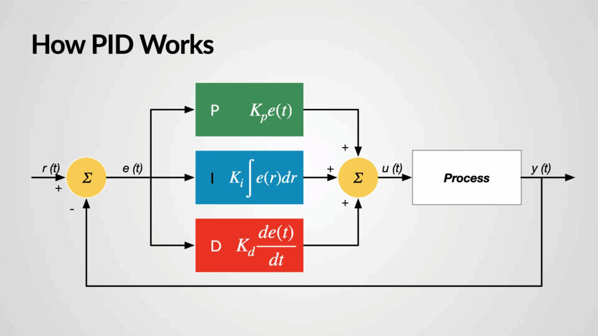

# 1. 制御とは何なのか

まず、制御の意味をざっくり知っておきましょう。

ロボット制御の「制御」とは英語controlの訳語です。では、controlとは本来どういう意味だったのでしょうか？語源を見てみましょう。

Etymonlineによれば、元々ラテン語でcontra(対抗)+rotulus(巻物)でcontrarotulus、ここでは「帳簿を照合する」という意味だったようです。

この時点で既に対象物が帳簿ではないという点を除けば、対象と目標を照合して修正するというのは制御の基本であるFB(フィードバック制御)にかなり近いと思います。(厳密には修正の意味までは含まれていないでしょうが、自然とでてくる発想だと思います)。それが古フランス語や中世英語などを経て、今のcontrolの形になったんですね。

また、JIS規格によると制御とは「ある目的に適合するように，対象となっているものに所要の操作を加えること」と定義されています。これはフィードバック制御だけに留まらない広義の定義になっています。

今はふわっとした理解で大丈夫です。後々モータ制御をしたり、PID制御を学ぶとしっくりくると思います。

## 人間の制御原理
制御についての解像度を若干高めたいと思うのですが、いきなりロボットの話をするとイメージがつき辛いかもしれません。ただ、幸いなことに人間もロボットも似たようなシステムとして解釈することができるので、我々の身体を題材にしましょう。

まず、自分の手が届く範囲にジュースが入ったペットボトルがあるとします。あなたの目標は手でペットボトルを掴んで一定の高さまで持ち上げることとします。ペットボトルがある場合は実際にやってみてください。非常に簡単ですね。持ってない場合は想像することにしましょう。

あなたがペットボトルを持ち上げたとしましょう。
では、ここで何が起こったでしょうか？

まず、ペットボトルを「目で見た」と思います。そして次の瞬間「手を伸ばし掴んだ」。少し詳しく言えば、目で見て情報を受け取り、脳に信号を送って処理し、適切な程度で筋肉を動かしてペットボトルを掴んで持ち上げることに成功したわけです。

ここで先ほどの制御の話を思いだしましょう。まず、JISの定義を振り返ると「ある目的に適合するように」とあるので今の操作が制御であれば目的、目標が必ずあるはずです。今回の目標はペットボトルを掴んで持ち上げることですね。これは先程も書いたばかりです。

次に、「対象となっているもの」とはなんでしょうか。思いつきそうなのは、腕かペットボトルでしょうか。文脈にもよりますが、今回は「腕」です。対象とか言っているのでペットボトルっぽいですが違います。この対象とは制御対象(プラント(plant))のことで、コントローラ(脳)によって制御されるもののことです。脳から指令を出して直接動かせるものは腕しかありません。この指令を受けて動くものをアクチュエータといいます。人間の場合は筋肉が相当します。

最後に「所定の動作を加えること」とありますが、これは単に制御対象である腕を指令によって動かしてペットボトルを掴むというだけですね。ということで、この一連の流れは歴とした制御であることがわかりました。

ここで少しだけ補足をします。このJIS規格の定義を読むと、「感覚器官やセンサから情報を取得し」のようなまたはそれに準ずることは全く書いてありません。なので「目で見る」という部分はオプションなんですね。しかし、完全に感覚を断ち切ってノールックでペットボトルを掴むことは容易ではありません。しかも実際は目だけでなく我々は触覚や聴覚も使っていますから、感覚を使えなければ掴めたかどうかすらわからないわけです。

この流れにおいて目は非常に大切な感覚器菅です。人間は目でペットボトルの位置と手の位置のズレを常に監視し、その情報を元に常に修正し続けています。それにより、精度高くペットボトルを掴めるわけです。更に言うとペットボトルが動こうが掴めますよね。この感覚器官から取得した今の情報と目標の誤差(偏差)を修正(フィードバック)し続けることによる制御をフィードバック制御といいます。そういう意味で、controlの語源は既にフィードバック制御っぽい発想だと言っているわけです。フィードバック制御は制御の基本中の基本です。

フィードバック「ループ」なので大体一定の制御周期で動いているわけですが、人間が目で見てから筋肉を動かすまでの反応時間（単純反応時間）は、一般的に0.2秒~程度です。5Hzとかそれくらいですね。これはコンピュータなどと比べると非常に遅いです。モータ制御ループだと1kHz以上は普通にあります。5Hzの制御周期だともっとカクカクしそうなものですが、人間の視覚フィードバックがこれだけ遅いのにこんなにもなめらかに動けるのには秘密があります。

結論から言ってしまうと、その秘密とは「予測(フィードフォワード)」です。人間は腕の重さ、モノの重さや距離感、筋肉の動かしかたを学習しており、脳内にある種のシミュレータを持っています。例えば先程の例だと、脳が今の腕の姿勢から目標位置まで腕を伸ばすには、これくらいの強さで肩と肘をこのタイミングで動かしetc..という計画を立て、その計画どおりに一気に電流を流し腕を動かします。ここでいちいち目の確認を待っていないので高速に動作することができます。これがフィードフォワード制御です。ただ、必ずしも一発でいけるわけではないですし、ペットボトルが何らかの力で動いたりすることもあるのでそこはフィードバック制御で修正します。

制御工学の言葉を使うと、人間はフィードフォワード制御とフィードバック制御を無意識に完璧に組み合わせて動いている高性能システムと言えるでしょう。

## ロボットはどうなのか
人間とは、感覚器官を用いて外界の情報を電気信号に変換し、脳で計算をし、その出力を元に筋肉というアクチュACTUATORを駆動するシステムでした。ロボットもそれぞれの要素が異なるだけでやっていることは全く一緒です。人間の感覚器官がセンサ、脳が計算機(コンピュータ)、筋肉がモータやシリンダーに変わるだけです。

ロボットはセンサで外界の情報を文字通り電気信号に変換し、コンピュータで計算し、出力をもとにモータを駆動する。これだけです。そもそもsensorとはsense(知覚する)モノですから、人間の感覚器官もロボットのセンサも全部sensorです。actuatorも動作させるものという意味ですが、筋肉もモータもこれの一種です。また、フィードバック制御だのフィードフォワード制御だの言ってましたが、その計算をしているのがcontroller(制御器)であり、脳や計算機もこの言葉でまとめられるでしょう。

難しいことは覚えなくていいので、
```
[ Sensor -> Controller -> Actuator ]
```
この流れだけ覚えましょう。

以下の図はブロック線図といって制御系の流れを表した図です。
Inputは目標値、Feedbackはセンサで取得した現在の値です。
`Error(偏差) = Input(目標値) - Feedback(現在値)`
この偏差をもとに、例えばその偏差を小さくする方向に制御値を出力し、モータを駆動し、またそのモータの回転数をエンコーダで計測し、目標に追従させていくといった流れになります。



こういった話に興味がある、また数式を使って追ってみたい場合は古典制御論を勉強すると良いです。更に発展した現代制御論というものもあります(こちらは実用まで持っていくのはかなり難易度が高いです)。現代制御論は古典制御論をベースにした学問という感じでもないので、どっちから先にやるとかはあまり関係ないと思います。古典制御論をさっとやっておくとかなり解像度が高くなります。制御工学は幅が広い感じがしますが、中心はこれだと思います。

教科書を買っていきなり勉強していくのは難易度が高いので、以下のサイトで少しずつまなんでいくと良いと思います。

## 結局何をすればいいのか
一言で言うと、Controllerを実装し動かすこと。これに尽きると思います。つまり、PCやマイコンといったハードウェア上で自分でプログラムを書いて実装したソフトウェアを載せ動作させるということです。ここでやっとプログラミングがでてきます。

もう少し詳しく言うと、一般的にすることは以下の3つだと思います

1. センサから適切にデータを取得する
2. 制御計算をする
3. モータへ駆動指令を出す

よくわからない人は「計算をして指令をだすもの」。これだけ覚えましょう。

勘違いしないで頂きたいのは、制御器のハードウェアは別にPC/マイコンに限らないということです。アナログ回路かもしれませんし、CPUが必要とも限りません。ただ、一般的にはPC+マイコンという構成が多いです。工場だとPLCといった専用のコンピュータを使っていますし、超高速制御ではFPGAという回路を自分で設計できるチップが使われることがあったりもします。ただ、我々が普段普段触れるのは専らマイコン/PCです。


## 現場における制御の実践的知見
ロボットのモータ制御においては、PIDを単に適用するだけでなく、実際のセンサ値に基づいたフィードバック（Closed Loop）制御が不可欠です。出力を一定にして見かけ上の速度や加速度を算出するようなOpen Loop的アプローチでは、ロボット特有の慣性や床面の状況といった不確定要素により、誤差が蓄積してしまいます。そのため、エンコーダやIMUから取得できる現実の値を適切にフィルタリングし、それを基にPIDや上位のシミュレーションと連携させることが、よりロバストな制御システムの構築に繋がります。
